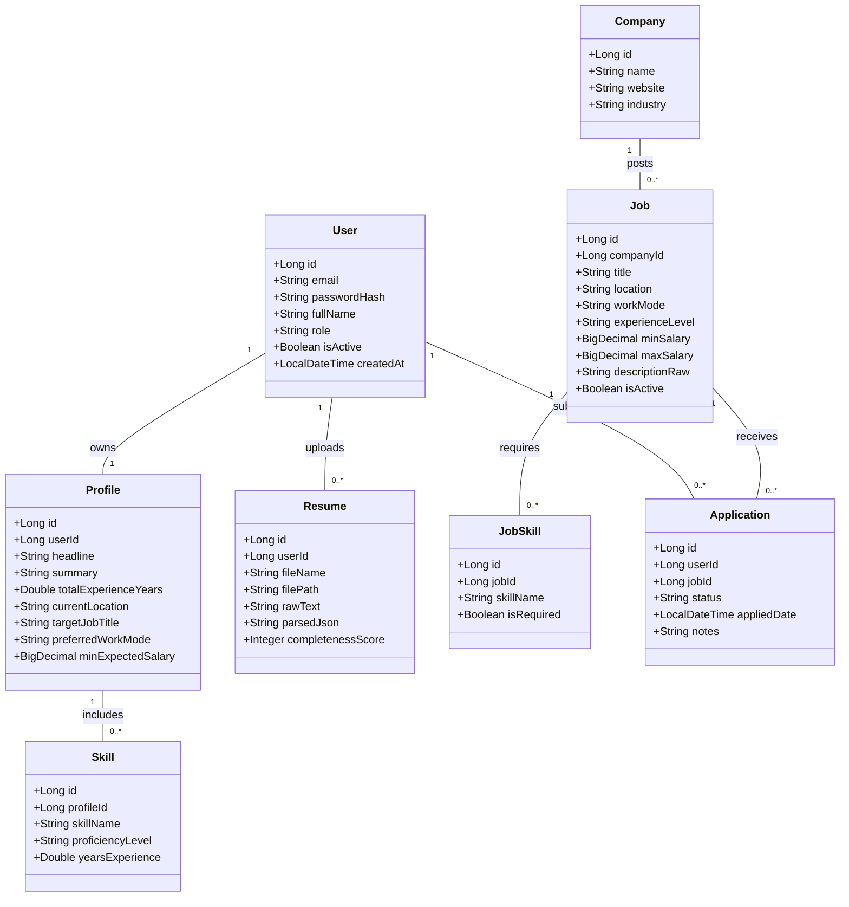

# Domain Class Diagram - CareerPilot AI

```mermaid
classDiagram
    class User {
        +Long id
        +String email
        +String passwordHash
        +String fullName
        +String role
        +Boolean isActive
        +LocalDateTime createdAt
    }

    class Profile {
        +Long id
        +Long userId
        +String headline
        +String summary
        +Double totalExperienceYears
        +String currentLocation
        +String targetJobTitle
        +String preferredWorkMode
        +BigDecimal minExpectedSalary
    }

    class Resume {
        +Long id
        +Long userId
        +String fileName
        +String filePath
        +String rawText
        +String parsedJson
        +Integer completenessScore
    }

    class Skill {
        +Long id
        +Long profileId
        +String skillName
        +String proficiencyLevel
        +Double yearsExperience
    }

    class Job {
        +Long id
        +Long companyId
        +String title
        +String location
        +String workMode
        +String experienceLevel
        +BigDecimal minSalary
        +BigDecimal maxSalary
        +String descriptionRaw
        +Boolean isActive
    }

    class Company {
        +Long id
        +String name
        +String website
        +String industry
    }

    class JobSkill {
        +Long id
        +Long jobId
        +String skillName
        +Boolean isRequired
    }

    class Application {
        +Long id
        +Long userId
        +Long jobId
        +String status
        +LocalDateTime appliedDate
        +String notes
    }

    User "1" -- "1" Profile : owns
    User "1" -- "0..*" Resume : uploads
    Profile "1" -- "0..*" Skill : includes
    User "1" -- "0..*" Application : submits
    Company "1" -- "0..*" Job : posts
    Job "1" -- "0..*" JobSkill : requires
    Job "1" -- "0..*" Application : receives
```
