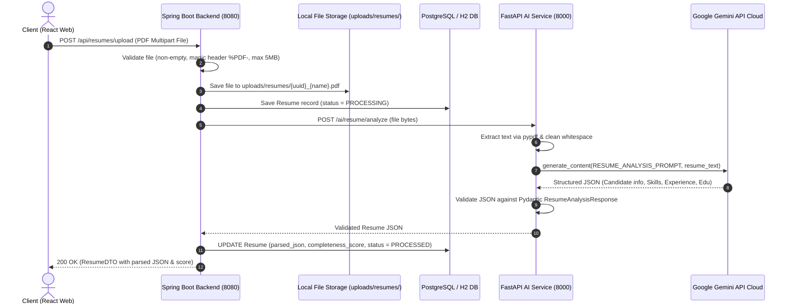
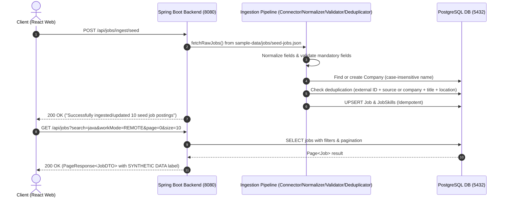
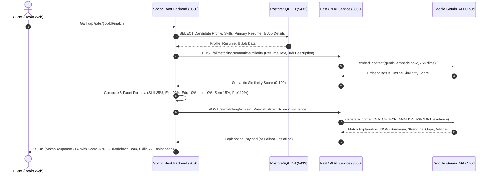
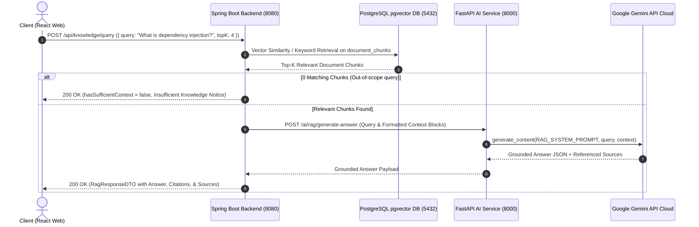
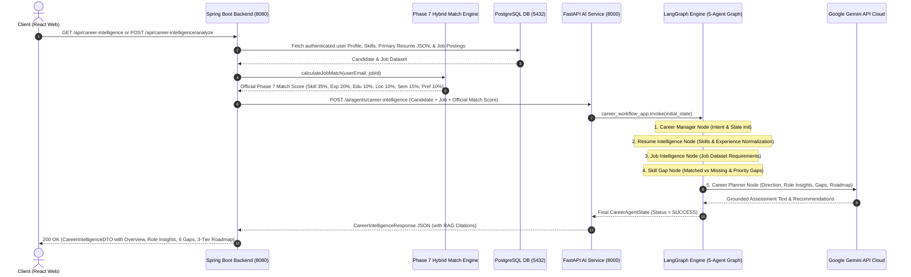

# Sequence Diagrams - CareerPilot AI

## 1. Resume Upload & Parsing Sequence

---

## 2. Job Ingestion & Search Sequence

---

## 3. Hybrid Job Recommendation Sequence

---

## 4. Grounded RAG Query & Citation Sequence

---

## 5. Multi-Agent Career Intelligence Sequence (Phase 10)

