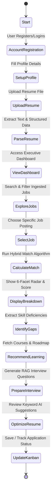

# Activity Diagram - CareerPilot AI

```mermaid
stateDiagram-v2
    [*] --> Start
    Start --> AccountRegistration: User Registers/Logins
    AccountRegistration --> SetupProfile: Fill Profile Details
    SetupProfile --> UploadResume: Upload Resume File
    UploadResume --> ParseResume: Extract Text & Structured Data
    ParseResume --> ViewDashboard: Access Executive Dashboard
    ViewDashboard --> ExploreJobs: Search & Filter Ingested Jobs
    ExploreJobs --> SelectJob: Choose Specific Job Posting
    SelectJob --> CalculateMatch: Run Hybrid Match Algorithm
    CalculateMatch --> DisplayBreakdown: Show 6-Facet Radar & Score
    DisplayBreakdown --> IdentifyGaps: Extract Skill Deficiencies
    IdentifyGaps --> RecommendLearning: Fetch Courses & Roadmap
    RecommendLearning --> PrepareInterview: Generate RAG Interview Questions
    PrepareInterview --> OptimizeResume: Review Keyword AI Suggestions
    OptimizeResume --> UpdateKanban: Save / Track Application Status
    UpdateKanban --> [*]
```
