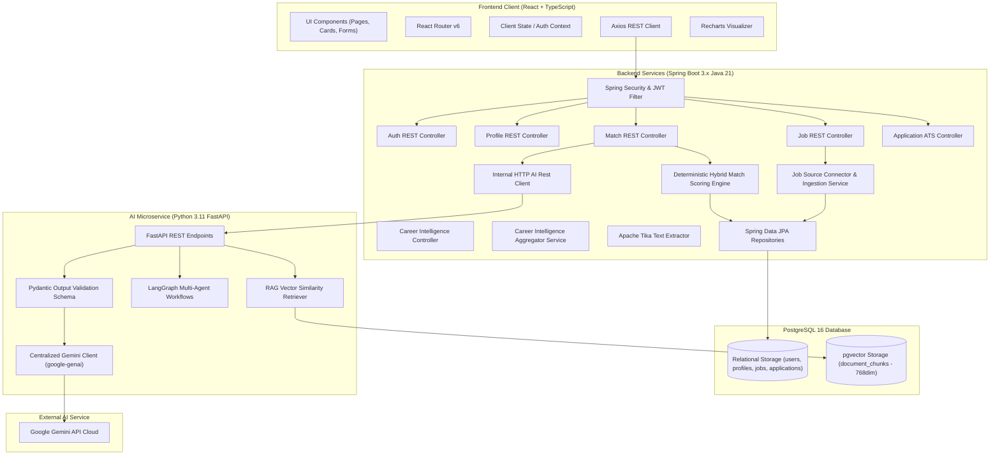

# Component Diagram - CareerPilot AI

```mermaid
graph TD
    subgraph ClientLayer ["Frontend Client (React + TypeScript)"]
        UI["UI Components (Pages, Cards, Forms)"]
        Router["React Router v6"]
        State["Client State / Auth Context"]
        AxiosClient["Axios REST Client"]
        Charts["Recharts Visualizer"]
    end

    subgraph BackendLayer ["Backend Services (Spring Boot 3.x Java 21)"]
        Security["Spring Security & JWT Filter"]
        AuthController["Auth REST Controller"]
        ProfileController["Profile REST Controller"]
        JobController["Job REST Controller"]
        MatchController["Match REST Controller"]
        CareerIntelController["Career Intelligence Controller"]
        AppController["Application ATS Controller"]
        
        CareerIntelService["Career Intelligence Aggregator Service"]
        JobIngestService["Job Source Connector & Ingestion Service"]
        MatchEngine["Deterministic Hybrid Match Scoring Engine"]
        ResumeParser["Apache Tika Text Extractor"]
        AIServiceConnector["Internal HTTP AI Rest Client"]
        JPARepos["Spring Data JPA Repositories"]
    end

    subgraph DatabaseLayer ["PostgreSQL 16 Database"]
        RelationalDB[("Relational Storage (users, profiles, jobs, applications)")]
        VectorDB[("pgvector Storage (document_chunks - 768dim)")]
    end

    subgraph AIServiceLayer ["AI Microservice (Python 3.11 FastAPI)"]
        FastAPIApp["FastAPI REST Endpoints"]
        GeminiClient["Centralized Gemini Client (google-genai)"]
        PydanticVal["Pydantic Output Validation Schema"]
        LangGraphEngine["LangGraph Multi-Agent Workflows"]
        RAGRetriever["RAG Vector Similarity Retriever"]
    end

    subgraph ExternalCloud ["External AI Service"]
        GeminiAPI["Google Gemini API Cloud"]
    end

    AxiosClient --> Security
    Security --> AuthController
    Security --> ProfileController
    Security --> JobController
    Security --> MatchController
    Security --> AppController

    JobController --> JobIngestService
    MatchController --> MatchEngine
    MatchController --> AIServiceConnector
    JobIngestService --> JPARepos
    MatchEngine --> JPARepos

    JPARepos --> RelationalDB

    AIServiceConnector --> FastAPIApp
    FastAPIApp --> PydanticVal
    FastAPIApp --> LangGraphEngine
    FastAPIApp --> RAGRetriever
    RAGRetriever --> VectorDB
    PydanticVal --> GeminiClient
    GeminiClient --> GeminiAPI
```
