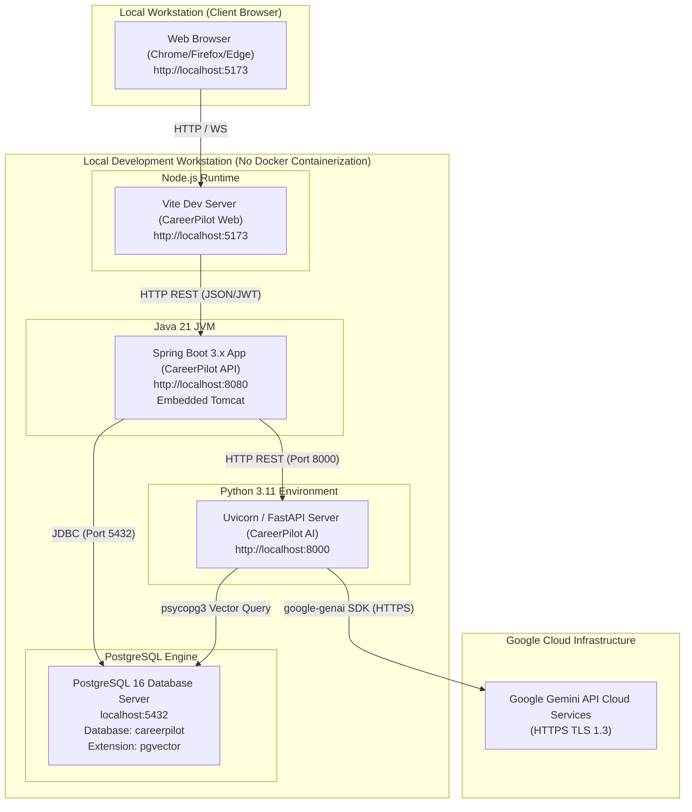

# Local Deployment Diagram - CareerPilot AI

```mermaid
graph TB
    subgraph ClientHost ["Local Workstation (Client Browser)"]
        Browser["Web Browser (Chrome/Firefox/Edge)\nhttp://localhost:5173"]
    end

    subgraph NativeLocalNode ["Local Development Workstation (No Docker Containerization)"]
        subgraph ViteNode ["Node.js Runtime"]
            ReactApp["Vite Dev Server (CareerPilot Web)\nhttp://localhost:5173"]
        end

        subgraph JavaJVM ["Java 21 JVM"]
            SpringBootApp["Spring Boot 3.x App (CareerPilot API)\nhttp://localhost:8080\nEmbedded Tomcat"]
        end

        subgraph PythonRuntime ["Python 3.11 Environment"]
            FastAPIApp["Uvicorn / FastAPI Server (CareerPilot AI)\nhttp://localhost:8000"]
        end

        subgraph PostgresHost ["PostgreSQL Engine"]
            PostgresDB["PostgreSQL 16 Database Server\nlocalhost:5432\nDatabase: careerpilot\nExtension: pgvector"]
        end
    end

    subgraph GoogleCloud ["Google Cloud Infrastructure"]
        GeminiCloud["Google Gemini API Cloud Services\n(HTTPS TLS 1.3)"]
    end

    Browser -- "HTTP / WS" --> ReactApp
    ReactApp -- "HTTP REST (JSON/JWT)" --> SpringBootApp
    SpringBootApp -- "JDBC (Port 5432)" --> PostgresDB
    SpringBootApp -- "HTTP REST (Port 8000)" --> FastAPIApp
    FastAPIApp -- "psycopg3 Vector Query" --> PostgresDB
    FastAPIApp -- "google-genai SDK (HTTPS)" --> GeminiCloud
```
