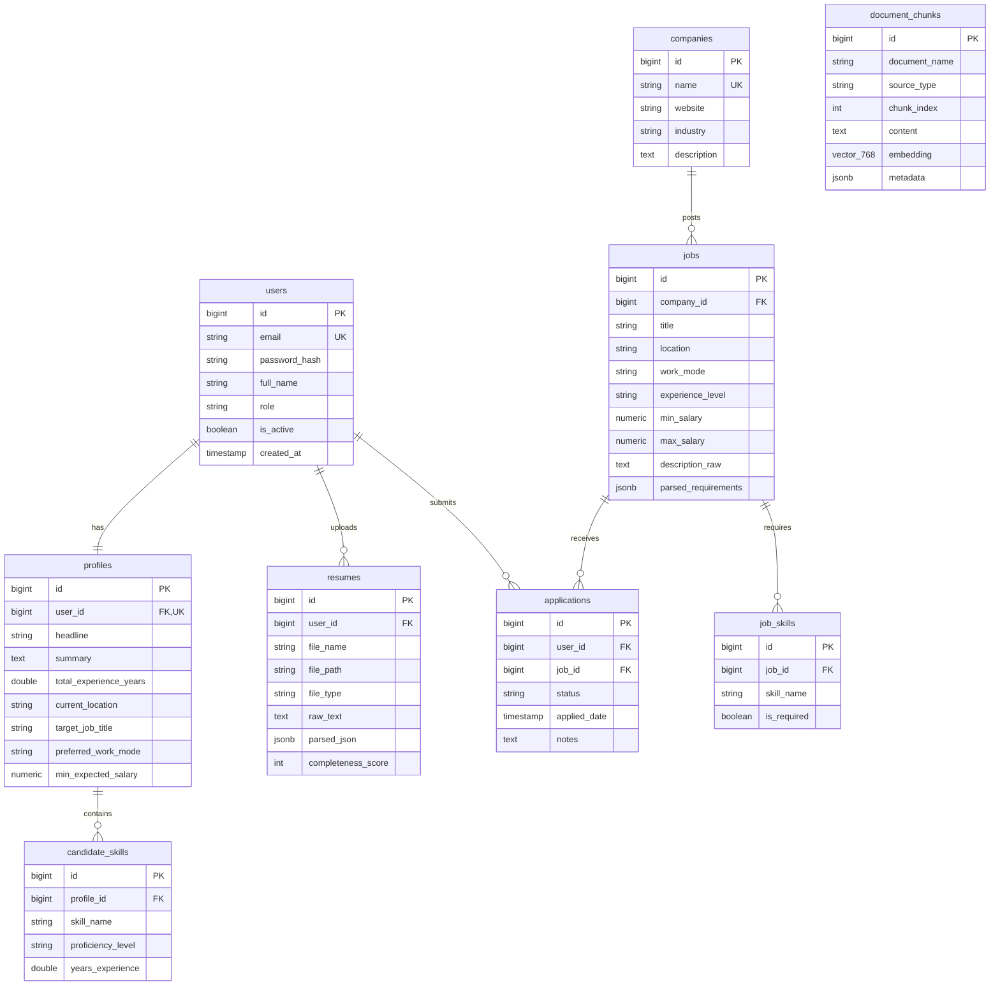

# Entity Relationship Diagram (ERD) - CareerPilot AI

```mermaid
erDiagram
    users ||--|| profiles : "has"
    users ||--o{ resumes : "uploads"
    users ||--o{ applications : "submits"
    profiles ||--o{ candidate_skills : "contains"
    companies ||--o{ jobs : "posts"
    jobs ||--o{ job_skills : "requires"
    jobs ||--o{ applications : "receives"
    
    users {
        bigint id PK
        string email UK
        string password_hash
        string full_name
        string role
        boolean is_active
        timestamp created_at
    }

    profiles {
        bigint id PK
        bigint user_id FK, UK
        string headline
        text summary
        double total_experience_years
        string current_location
        string target_job_title
        string preferred_work_mode
        numeric min_expected_salary
    }

    resumes {
        bigint id PK
        bigint user_id FK
        string file_name
        string file_path
        string file_type
        text raw_text
        jsonb parsed_json
        int completeness_score
    }

    candidate_skills {
        bigint id PK
        bigint profile_id FK
        string skill_name
        string proficiency_level
        double years_experience
    }

    companies {
        bigint id PK
        string name UK
        string website
        string industry
        text description
    }

    jobs {
        bigint id PK
        bigint company_id FK
        string title
        string location
        string work_mode
        string experience_level
        numeric min_salary
        numeric max_salary
        text description_raw
        jsonb parsed_requirements
    }

    job_skills {
        bigint id PK
        bigint job_id FK
        string skill_name
        boolean is_required
    }

    applications {
        bigint id PK
        bigint user_id FK
        bigint job_id FK
        string status
        timestamp applied_date
        text notes
    }

    document_chunks {
        bigint id PK
        string document_name
        string source_type
        int chunk_index
        text content
        vector_768 embedding
        jsonb metadata
    }
```
