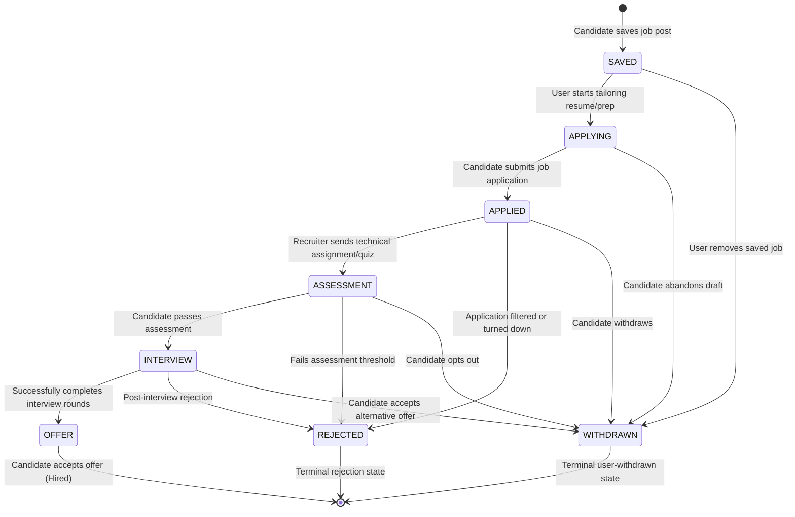

# Application Status State Machine Diagram - CareerPilot AI

```mermaid
stateDiagram-v2
    [*] --> SAVED : Candidate saves job post
    
    SAVED --> APPLYING : User starts tailoring resume/prep
    SAVED --> WITHDRAWN : User removes saved job
    
    APPLYING --> APPLIED : Candidate submits job application
    APPLYING --> WITHDRAWN : Candidate abandons draft
    
    APPLIED --> ASSESSMENT : Recruiter sends technical assignment/quiz
    APPLIED --> REJECTED : Application filtered or turned down
    APPLIED --> WITHDRAWN : Candidate withdraws
    
    ASSESSMENT --> INTERVIEW : Candidate passes assessment
    ASSESSMENT --> REJECTED : Fails assessment threshold
    ASSESSMENT --> WITHDRAWN : Candidate opts out
    
    INTERVIEW --> OFFER : Successfully completes interview rounds
    INTERVIEW --> REJECTED : Post-interview rejection
    INTERVIEW --> WITHDRAWN : Candidate accepts alternative offer
    
    OFFER --> [*] : Candidate accepts offer (Hired)
    REJECTED --> [*] : Terminal rejection state
    WITHDRAWN --> [*] : Terminal user-withdrawn state
```
